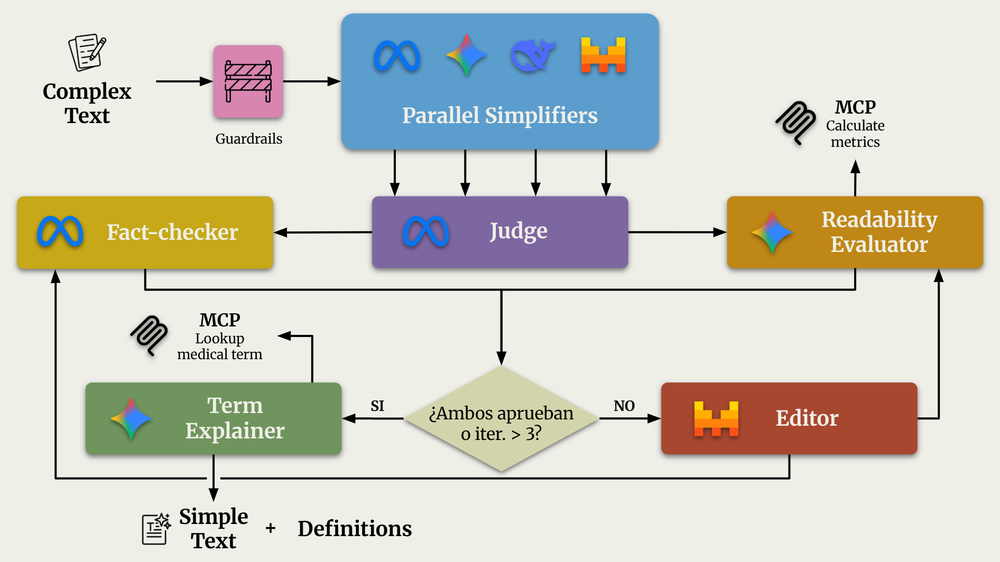

# Text Simplification ISC

Sistema multi-agente inteligente para simplificar documentos médicos complejos manteniendo precisión clínica y mejorando la legibilidad. Utiliza agentes LLM especializados organizados en un flujo de trabajo Draft-Select-Audit-Edit que garantiza la calidad de simplificaciones mediante validación de hechos y métricas de legibilidad.


## Tabla de contenidos

- [Arquitectura del sistema](#arquitectura-del-sistema)
- [Requisitos](#requisitos)
- [Instalación](#instalación)
- [Uso](#uso)
- [Configuración](#configuración)
- [Contribuir](#contribuir)
- [Licencia](#licencia)

## Arquitectura del sistema

El sistema implementa un flujo de trabajo **Draft-Select-Audit-Edit** mediante LangGraph:



1. **Guardrails**: Agente encargado de comprobar que la entrada pertenezca al dominio médico/biomédico.

2. **Parallel Drafters**: Generan 4 propuestas de versiones simplificadas en paralelo.
   
2. **Judge (Juez)**: Selecciona el mejor candidato basándose en directrices de [Plain Language](https://plainlanguagenetwork.org/plain-language/what-is-plain-language/), naturalidad y cohesión.
   
3. **Evaluators**: Validan la calidad de la simplificación
     - **Fact Checker**: Asegura la fidelidad numérica y clínica respecto a la entrada original.
     - **Readability Evaluator**: Valida accesibilidad y métricas de legibilidad (puede hacer uso de una herramienta vía [MCP](https://modelcontextprotocol.io/docs/getting-started/intro))
   
4. **Editor**: Mejora la versión simplificada teniendo en cuenta el feedback de los evaluadores.
     - Loop guard: Máximo 3 iteraciones para evitar bucles infinitos.

5. **Term Explainer**: Agente cuya tarea es identificar términos complejos en la simplificación final y obtener una explicación en Plain Language a través de una herramienta MCP.

Más detalles del workflow en [src/graph/workflow.py](src/graph/workflow.py).

Implementación de los agentes en [src/graph/workflow.py](src/agents/).

## Requisitos

- **Python** >= 3.13
- **uv** (recomendado para instalar y ejecutar el proyecto)
- **pip** >= 23.0 (alternativa de gestión de dependencias)
- **Variables de entorno** configuradas para LLM (consulta [Configuración](#configuración))

### Dependencias principales

- **LangChain & LangGraph**: Orquestación de agentes y workflows
- **Streamlit**: Interfaz web interactiva
- **Multiple LLM Providers**: Gemini, Groq, Mistral, Ollama, OpenAI
- **Evaluación**: BERT-Score, BERTScore, textstat para métricas

## Instalación

### 1. Clona el repositorio

```bash
git clone https://github.com/usuario/Text-Simplification-ISC.git
cd Text-Simplification-ISC
```

### 2. Instala con `uv` (recomendado)

`uv` es la opción recomendada para gestionar el entorno y las dependencias.

```bash
uv sync
```

Para ejecutar el proyecto con `uv`:

```bash
uv run python main.py
uv run streamlit run app.py
```

### 3. Crea un entorno virtual manualmente (alternativa)

```bash
# Con venv
python3.13 -m venv venv
source venv/bin/activate  # En Windows: venv\Scripts\activate

# O con conda
conda create -n text-simplification python=3.13
conda activate text-simplification
```

### 4. Instala las dependencias manualmente (alternativa)

```bash
pip install -e .
```

O instala manualmente desde pyproject.toml:

```bash
pip install bert-score evaluate mcp langchain-core langchain-google-genai \
  langchain-groq langchain-mistralai langchain-ollama langchain-openai \
  langgraph numpy sacrebleu textstat streamlit
```

## Uso

### Ejecutar el workflow (CLI)

```bash
python main.py
```

Este comando:
1. Inicializa el sistema multi-agente
2. Procesa un texto de ejemplo
3. Muestra el progreso de cada etapa (Drafters, Judge, Auditors, Editor)
4. Genera versiones simplificadas validadas

### Ejecutar la interfaz Streamlit (recomendado)

```bash
streamlit run app.py
```

Accede a: `http://localhost:8501`

**Características de la interfaz:**
- Entrada de texto complejo
- Visualización en tiempo real del progreso
- Comparación de versiones
- Métricas de legibilidad
- Exportación de resultados

## Configuración

### Variables de entorno

Crea un archivo `.env` en la raíz del proyecto:

```bash
cp .env.example .env
```

O establece manualmente las siguientes variables:

| Variable | Descripción | Valores | Default |
|---|---|---|---|
| `LLM_PROVIDER` | Proveedor de LLM a usar | `gemini`, `ollama`, `groq`, `mistral`, `openai` | `gemini` |
| `OLLAMA_MODEL` | Modelo de Ollama (si LLM_PROVIDER=ollama) | `mistral`, `llama2`, `neural-chat`, etc. | - |
| `OLLAMA_BASE_URL` | URL base de Ollama | URL completa | `http://localhost:11434` |
| `LOCAL_MODE` | Activar modo local con Ollama | `0` o `1` | `0` |
| `GOOGLE_API_KEY` | Clave API de Google Gemini | Tu clave API | - |
| `GROQ_API_KEY` | Clave API de Groq | Tu clave API | - |
| `MISTRAL_API_KEY` | Clave API de Mistral | Tu clave API | - |
| `OPENAI_API_KEY` | Clave API de OpenAI | Tu clave API | - |

### Configuración de modelos específicos

Puedes asignar modelos diferentes a cada rol usando variables de entorno:

```bash
export DRAFTER_MODEL_A=gemini-2.0-flash
export DRAFTER_MODEL_B=gemini-1.5-pro
export DRAFTER_MODEL_C=gemini-1.5-flash
export DRAFTER_MODEL_D=gemini-1.5-flash
export JUDGE_MODEL=gemini-2.0-flash
export EDITOR_MODEL=gemini-1.5-pro
```

Si no se especifican, el sistema usa valores por defecto según el proveedor.

### Ejemplo: Usar Ollama (LLM local)

```bash
export LLM_PROVIDER=ollama
export OLLAMA_MODEL=mistral
export LOCAL_MODE=1
python main.py
```

## Contribuir

Las contribuciones son bienvenidas. Para contribuir:

1. **Fork** el repositorio
2. Crea una rama para tu feature (`git checkout -b feature/mi-mejora`)
3. Realiza tus cambios y **commit** (`git commit -m 'Agregar: descripción de mejora'`)
4. **Push** a tu rama (`git push origin feature/mi-mejora`)
5. Abre un **Pull Request** describiendo los cambios

### Pautas de contribución

- Sigue el estilo de código existente
- Incluye tests para nuevas funcionalidades
- Actualiza la documentación si aplica
- Documenta cambios en las variables de entorno

## Licencia

Distribuido bajo la licencia MIT. Ver [`LICENSE`](LICENSE) para más información.

---

Para reportar issues o sugerencias, abre un [issue](https://github.com/usuario/Text-Simplification-ISC/issues) en el repositorio.