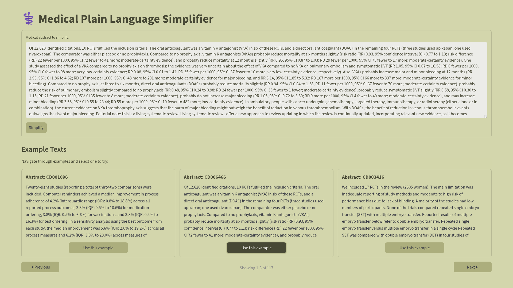
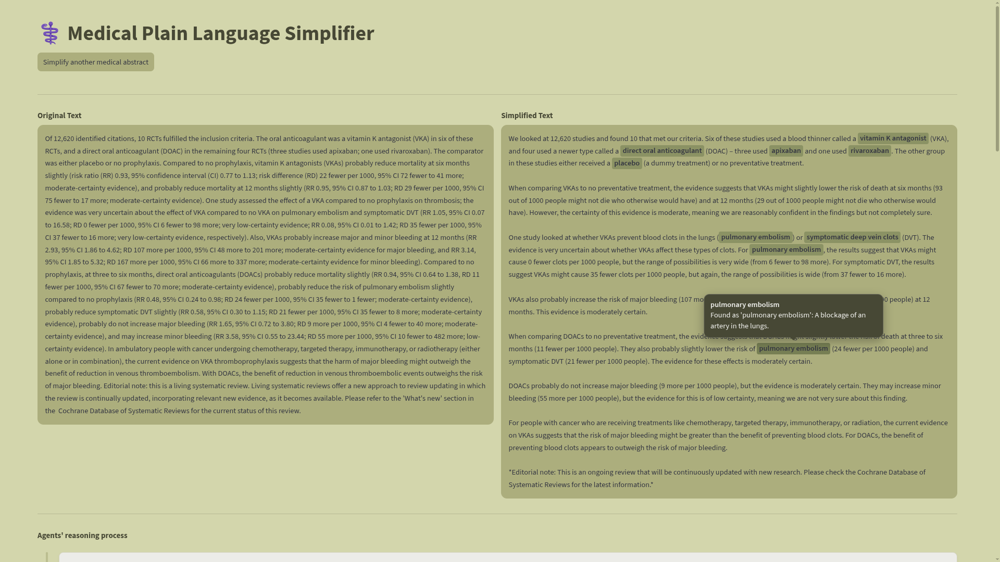
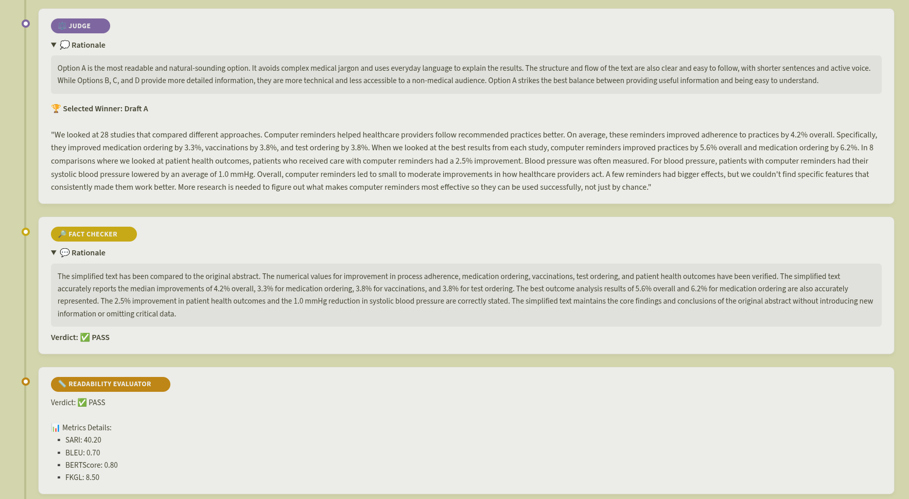

# Text Simplification ISC

Sistema multi-agente inteligente para simplificar documentos médicos complejos manteniendo precisión clínica y mejorando la legibilidad. Utiliza agentes LLM especializados organizados en un flujo de trabajo Draft-Select-Audit-Edit que garantiza la calidad de simplificaciones mediante validación de hechos y métricas de legibilidad.


## Tabla de contenidos

- [Arquitectura del sistema](#arquitectura-del-sistema)
- [Requisitos](#requisitos)
- [Instalación](#instalación)
- [Interfaz de la aplicación](#interfaz-de-la-aplicación)
- [Contribuir](#contribuir)
- [Licencia](#licencia)

## Arquitectura del sistema

El sistema implementa un flujo de trabajo **Draft-Select-Audit-Edit** mediante LangGraph:


1. **Guardrails**: Agente encargado de comprobar que la entrada pertenezca al dominio médico/biomédico.

2. **Parallel Drafters**: Generan 4 propuestas de versiones simplificadas en paralelo.
   
2. **Judge (Juez)**: Selecciona el mejor candidato basándose en directrices de [Plain Language](https://plainlanguagenetwork.org/plain-language/what-is-plain-language/), naturalidad y cohesión.
   
3. **Evaluators**: Validan la calidad de la simplificación
     - **Fact Checker**: Asegura la fidelidad numérica y clínica respecto a la entrada original.
     - **Readability Evaluator**: Valida accesibilidad y métricas de legibilidad (puede hacer uso de una herramienta vía [MCP](https://modelcontextprotocol.io/docs/getting-started/intro))
   
4. **Editor**: Mejora la versión simplificada teniendo en cuenta el feedback de los evaluadores.
     - Loop guard: Máximo 3 iteraciones para evitar bucles infinitos.

5. **Term Explainer**: Agente cuya tarea es identificar términos complejos en la simplificación final y obtener una explicación en Plain Language a través de una herramienta MCP.

Más detalles del workflow en [src/graph/workflow.py](src/graph/workflow.py).

Implementación de los agentes en [src/agents/](src/agents/).

## Requisitos

- **Python** >= 3.13
- **uv** (recomendado para instalar y ejecutar el proyecto)
- **pip** >= 23.0 (alternativa de gestión de dependencias)
- **Variables de entorno** configuradas para LLM (consulta [Configuración](#configuración))

### Dependencias principales

- **LangChain & LangGraph**: Orquestación de agentes y workflows
- **Streamlit**: Interfaz web interactiva
- **Multiple LLM Providers**: Gemini, Groq, Mistral, Ollama, OpenAI
- **Evaluación**: BERTScore, textstat para otras métricas

## Instalación

### 1. Clonar el repositorio

```bash
git clone https://github.com/sandracondee/Text-Simplification-ISC.git
cd Text-Simplification-ISC
```
### 2. Configurar variables de entorno

Ejecutar este comando para copiar el contenido del fichero .env.example en un fichero .env y rellenar las API Keys correspondientes.

```bash
cp .env.example .env
```

### 3. Instalar dependencias con `uv` (recomendado)

`uv` es la opción recomendada para gestionar el entorno y las dependencias.

```bash
uv sync
```
Para que el sistema pueda calcular métricas y realizar búsquedas, es necesario tener activos los servidores (MCP) en terminales separadas:

```bash
# Servidor de métricas
uv run python -m src.mcp.metrics_server

# Servidor de búsqueda
uv run python -m src.mcp.search_server
```

Para ejecutar el proyecto con `uv`:

```bash
uv run streamlit run app.py
```

Acceder a `http://localhost:8501` para utilizar el sistema.

### 4. (Alternativa) Crear un entorno virtual manualmente 

```bash
# Con venv
python -m venv venv
source venv/bin/activate  # En Windows: venv\Scripts\activate

```
Instalar las dependencias con pip

```bash
pip install -e .
```

Arrancar servidores mcp en terminales separadas

```bash
# Servidor de métricas
python -m src .mcp.metrics_server

# Servidor de búsqueda
python -m src .mcp.search_server
```

Ejecutar la aplicación

```bash
streamlit run app . py
```

Acceder a `http://localhost:8501` para utilizar el sistema.

## Interfaz de la aplicación

Pantalla de inicio de la aplicación que muestra el área de entrada de texto y el selector de ejemplos.



Vista de resultados donde se presenta la versión simplificada del texto médico, incluyendo definiciones contextuales al pasar el ratón sobre los términos complejos.



Proceso de razonamiento de los agentes del sistema.



## Contribuir

Las contribuciones son bienvenidas 😊. Para contribuir:

1. **Fork** el repositorio
2. Crea una rama para tu feature (`git checkout -b feature/mi-mejora`)
3. Realiza tus cambios y **commit** (`git commit -m 'Agregar: descripción de mejora'`)
4. **Push** a tu rama (`git push origin feature/mi-mejora`)
5. Abre un **Pull Request** describiendo los cambios

## Licencia

Distribuido bajo la licencia MIT. Ver [`LICENSE`](LICENSE) para más información.

---

Para reportar issues o sugerencias, abre un [issue](https://github.com/usuario/Text-Simplification-ISC/issues) en el repositorio.